# 1.0 Network Fundementals


## 1.1 Compare and Constract OSI and TCP/IP Models
### OSI Model: Reference Model
> "One Model to rule them all!"

In 1970s, ISO –– a standardizing organization came with a networking model that was vendor neutral. ISO is not an acronym but the Greek word for "EQUAL" meaning that all the countries that participated had an equal voice in the standardizations. This was meant to replace proprietary models for this standardized model. It had a goal of making sure that everyone computer the world could be networked together.

Name | Function | Protocols | Devices | PDU (Protocol Data Unit) while Encapsulation | PDU Name
------------ | ------------- | ------------ | ------------- | ------------- | -------------
L7: Application | Creats and opens the data | HTTP, HTTPs, SMTP | User Apps | L7H + Data | 
L6: Presentation | Formatting, Encryption | JPEG, ASCII, .gif, .tiff |  | L6H + L7H + Data | 
L5: Session | Synchronization, Logical Ports | SQL, NFS, NetBIOS | Logical Ports | L5H + L6H + L7H + Data | 
L4: Transport | Segmentation | TCP, UDP, SPX | Firewalls, Hosts | L4H + L5H + L6H + L7H + Data | Segment
L3: Network | Addressing | IP, IPS, ARP, ICPM | Routers | L3H + L4H + L5H + L6H + L7H + Data | Packet
L2: Data Link | Forwarding to the Next Device | Ethernet, Frame Relay, PPP, HDLC | NICs, L2 Switches | L2H + L3H + L4H + L5H + L6H + L7H + Data + FCS (Frame Check Sequence) | Frame 
L1: Physical | Media Pathways |  | Cabling, Connectors, Lights, Hubs | 110101010001011110110010101010101 | Bits

* **L1 - L4:** Prepares the data for network delivery to the destination. When troubleshooting, we focus on these layers, since we're focusing on delivery itself.
* **L5 - L7:** Prepares the data for destination to understand.

### TCP/IP Model: Networking Model
> "Language of the Internet"

Historically, it was the competing standardized networking model to the OSI. The OSI was never really implemented widely but used more as reference and TCP/IP became the widely implemented model.

<table>
  <tr>
    <th>TCP/IP (Original)</th>
    <th>PDU</th>
    <th>TCP/IP (Updated)</th>
    <th>PDU</th>
    <th>Notes</th>
  </tr>
  <tr>
    <td>Application</td>
    <td></td>
    <td>Application</td>
    <td></td>
    <td>Interface between apps and network</td>
  </tr>
  <tr>
    <td>Transport</td>
    <td>Segment</td>
    <td>Transport</td>
    <td>Segment</td>
    <td>Provides Service to the Application layer, e.g.: Error Recovery</td>
  </tr>
    <tr>
    <td>Internet</td>
    <td>Packet</td>
    <td>Internet</td>
    <td>Packet</td>
    <td>Routing</th>
  </tr>
    <tr>
    <td rowspan=2>Network Access</td>
    <td rowspan=2>Frame + Bits</td>
    <td>Data Link</td>
    <td>Frame</td>
    <td rowspan=2>Forwards "Frames" & "Bits" towards destination accross the media, it's like a truck in the real world</td>
  </tr>
    <tr>
    <td>Phyical</td>
    <td>Bits</td>
  </tr>
</table>

* **Network Access** was too generic.


## 1.2 Compare and Constract TCP and UDP Protocols
### Transport Layer
* Transport Layer protocols provides **session multiplexing**. That is multiple applications can use the same IP address and not break the networking.
* Transport Layer protocols segment the data into manageable chunks of data for transmitting data across networks.
* Can provide for guaranteed data delivery (if TCP is used).

### TCP: Transmission Control Protocol
* Reliable - Guaranteed Data Delivery
* Connection-Oriented: Synchronizes connection between source and destination before any data is sent.
* Provides sequencing for Error Recovery.
* Uses: 80 to 90 % of traffic. e.g.: file sharing, downloading, webpages, email...
* Flow Control: It means that TCP will do the handshake per *window size* not on every packet, which prevents a slow connection.

#### TCP Header
<table>
  <tbody>
  <th colspan="8">16-Bit</th>
  <th colspan="2">16-Bit</th>
  <tr>
    <td colspan="8" style="text-align: center;">Source Port (0 - 65535)</td>
    <td colspan="2">Destination Port (0 - 65535)</td>
  </tr>
  <tr>
    <td colspan="10" style="text-align: center;">Sequence Number (0 - 4294967295)</td>
  </tr>
  <tr>
    <td colspan="10" style="text-align: center;">Acknowledgement Number (0 - 4294967295)</td>
  </tr>
  <tr>
    <td style="text-align: center;">Data</strong></td>
    <td><em>Reserved</em></td>
    <td>U</br>R<br>G</td>
    <td>A<br>C<br>K</td>
    <td>P<br>S<br>H</td>
    <td>R<br>S<br>T</td>
    <td>S<br>Y<br>N</td>
    <td>F<br>I<br>N</td>
    <td colspan="2" style="text-align: center;">Window</td>
  </tr>
  <tr>
    <td colspan="8" style="text-align: center;">Checksum (CRC-Check)</td>
    <td colspan="2" style="text-align: center;">Urgent Pointer</td>
  </tr>
  <tr>
    <td colspan="9" style="text-align: center;">Options</td>
    <td style="text-align: center;">Padding</td>
  </tr>
  <tr>
  <td colspan="10" style="text-align: center;">Data</td>
  </tr>
</tbody>
</table>

#### TCP 3-Way Handshake
1. Sender: ```Seq:100|CTL: SYN``` to Reciever
2. Reciever: ```Seq:200/ACKSeq:101|CTL: SYN/ACK``` to Sender
3. Sender: ```Seq:102/Seq:201|CTL: ACK``` to Reciever

* *Seq:* Sequence Number
* *CTL:* Control
* *SYN:* Synchronization Flag
* *ACK:* Acknowledgement Flag

### UDP: User Datagram Protocol
* Unreliable - Best Effort Delivery
* Connectionless: No synchronization.
* Error detection (Checksum) but no Error Recovery, data packets can be dropped, and no sequencing.
* Uses: Streaming Video, Voice Traffic, Real-Time Services, etc.

#### UDP Header
<table style="text-align: center;">
<th colspan="10">16-Bit</th>
<th colspan="10">16-Bit</th>
<tbody>
<tr>
  <td colspan="10">Source Port</td>
  <td colspan="10">Destination Port</td>
</tr>
<tr>
  <td colspan="10">Length</td>
  <td colspan="10">Header and Data Checksum</td>
</tr>
</tbody>
</table>


## 1.3 Describe The Impact of Infrastructure Components In An Enterprise Network
### Enterprise Networking Components
> "Components that help make your network more secure!"

* **Cisco ASAs:** Create a barrier between a trusted network and untrusted network. By default allowing traffice to flow from trusted to untrusted. But by default blocks traffice from untrusted to trusted.
* **Sourcefire (today called Firepower):** Runs on dedicated hardware. NGFWs (Next-Gen Firewalls), NGIPSs (Next-Gen Intrusion Prevention Systems).
* **Access points:** Connects wireless devices to wired network. Extends the broadcast domain of the wired network. CSMA/CA (CSMA/CD).
* **Wireless controllers:** Manages multiple access points, centralizes configuration, reduces administrative redundancy, controls frequency usage, controls antennae strength.
* **Switches:** Makes forwarding decision based on Layer 2 addressing.
* **Routers:** Makes routing decisiion based on Layer 3 addressing.

## 1.4 Compare and Contrast Collapsed Core and Three-Tier Architectures
### Why Do We Need to Learn About Networking Architectures?
* Each business brings different set of circumstances that a standard network design will not work for everything.
* We cannot approach companies and clients with the idea of just throwing hardward into the mix without a plan or design. Too much is a waste and may not provide any better solution. Too little means taxing the hardware to do more than it was meant to do.
* *Scalability!!*

### Goal of Design
Provides a scalable and manageable network for the business
Cisco provides design guidelines to help

### Three-Tier Architecture
  * **Core:** Backbone
  * **Distribution:** Filtering and Routing Politics
  * **Access:** Apply Network Access Policies
  
  <p align="center">
  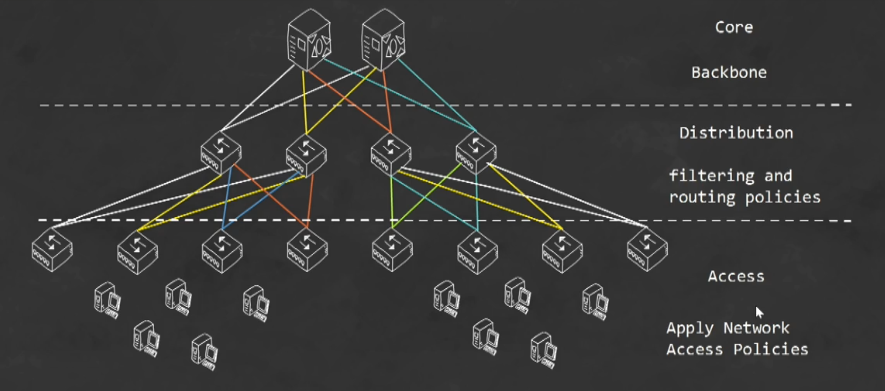
  </p>

### Collapsed Core Architecture
  * Core & Distribution
  * Access
  
  <p align="center">
  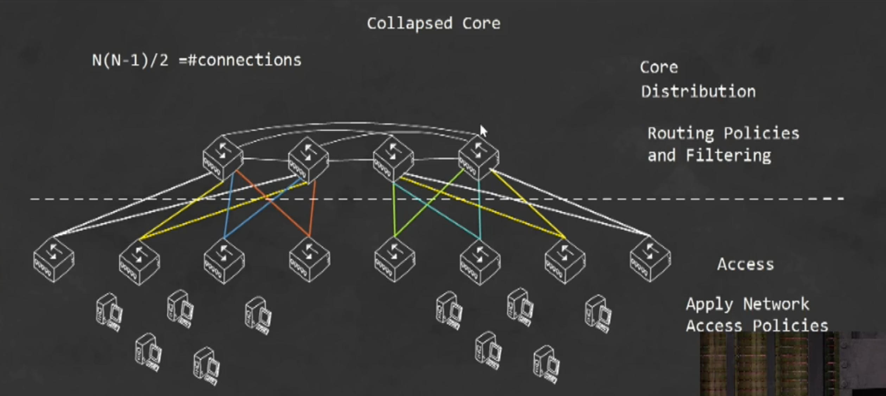
  </p>

## 1.5 Compare and Contrast Network Topologies
### Star
* Used for LANs.
* Every device has a direct connection back to centralized connectivity device (usually a switch) so that one device or cable issue will not cause the rest of the network to fail.
<p align="center">
  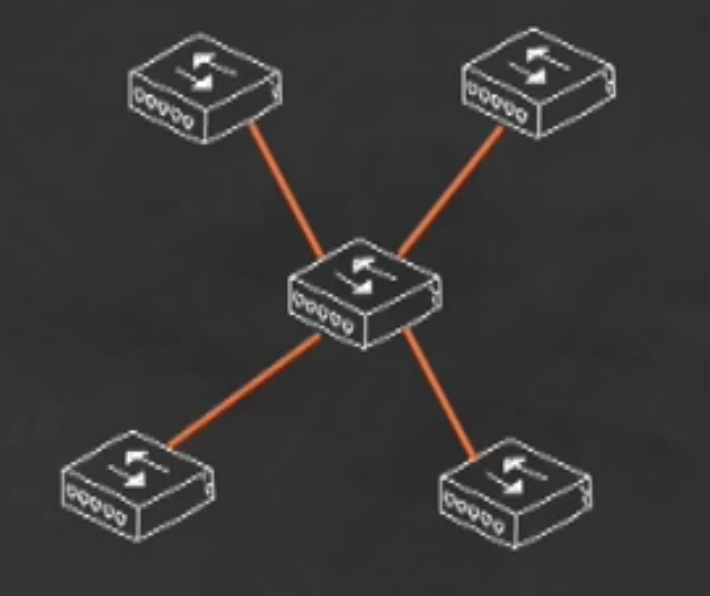
</p>

### Mesh
* Used for WANs & Service Providers networks.
* Provides for redundancy of devices so that the failure of any single connection will not affect communications.
* Determine the number of connectioons needed: ```N(N-1)/2``` . *where N = # of nodes* 
<p align="center">
  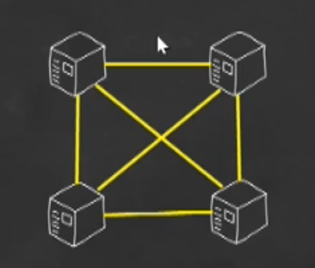
</p>

### Hyprid
* Custom
* Provides redundancy for critical services but also single connectivity for devices that are not critical but necessary.
* E.g.: We might provide a full mesh for our database servers or virtualization services. So, we provide single links to access switches for users on workstations.
<p align="center">
  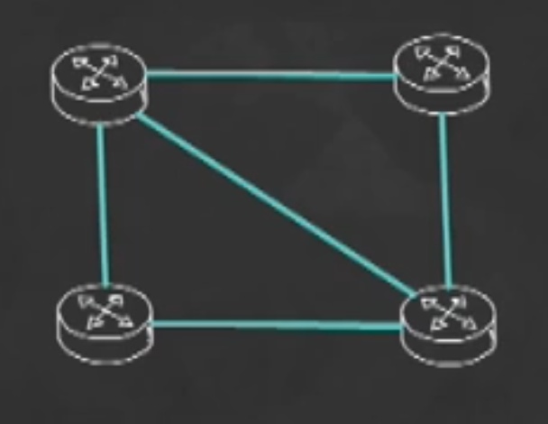
</p>

## 1.6 Select The Appropriate Cabling Type Based on Implementation Requirements
### Fiber
* Very long distances, but seeing it more on the LAN as well
* Human hair is 50 microns, Fiber core is 9 microns in single mode, and 62.6 micron in multimode
* Construction:
  * Core
  * Cladding industry standard at 125 microns
  * Buffer
* Types:
  * Single mode fiber: tighter cladding = smaller core, one mode of light propagates
  * Multi-mode fiber: looser, larger core allows multiple light particles, less distance
* Connectors:
  * SC
  * LC
  * ST
  * FC
  * MTRJ

<div style="text-align: center">
<p align="center" style="display: inline-block;">
  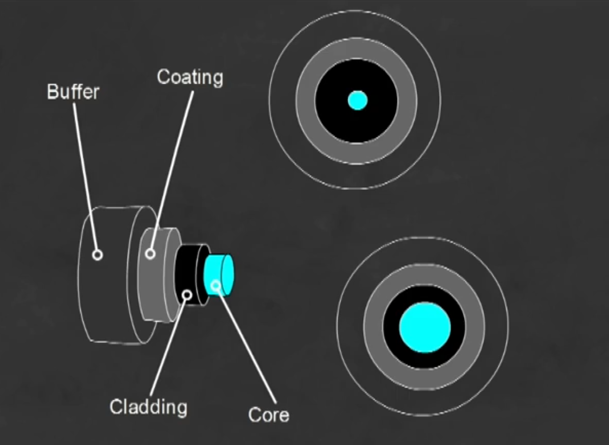
</p>
<p align="center" style="display: inline-block;">
  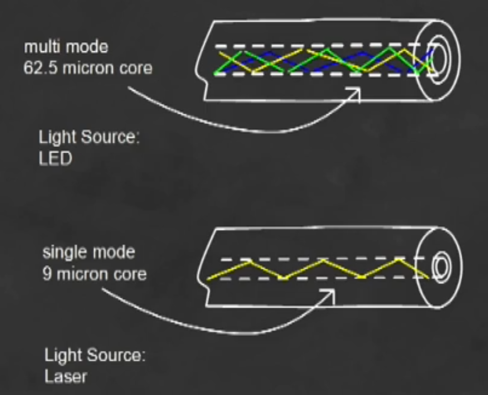
</p>
</div>

### Twisted-Pair
#### Straight-through 
* Usage:
  * Switch to PC
  * Router to Switch

<p style="text-align: center;">
  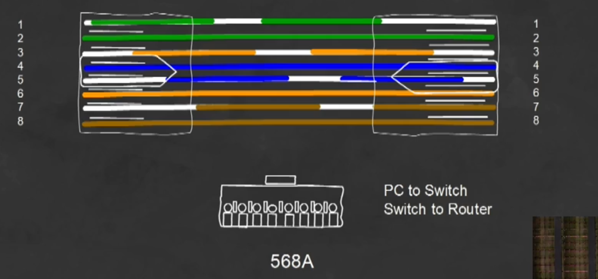
</p>

#### Crossover
* Usage: 
  * Switch to Switch (autodetect on most switches will work with straight-through cables, but crossover is the correct choice -AutoMDIX)
  * Router to Router
  * Router to PC

<p style="text-align: center;">
  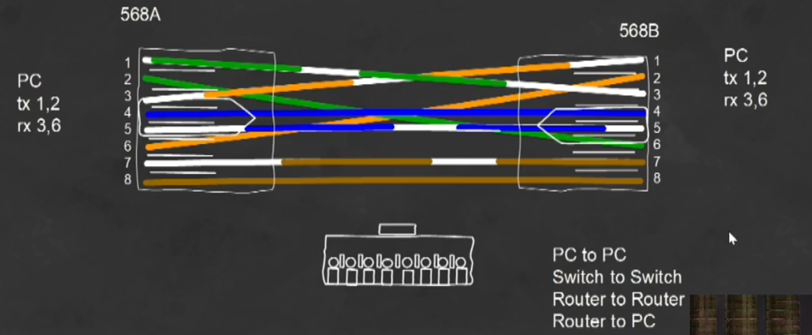
</p>

#### Rollover
* Usage:
  * Connect a host EIA-TIA 232 interface to a router console serial COM port
  * Show Console Cable

  <p style="text-align: center;">
  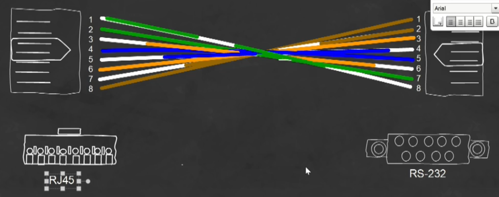
</p>

<table>
<th>Category</th>
<th>Network Usage</th>
<th>Throughput</th>
<th>Cable, etc</th>
<tr>
<td>Cat 1</td>
<td>Telephone, DSL</td>
<td>up to 100 Mbps</td>
<td>UTP, single pair</td>
</tr>
<tr>
<td>Cat 3</td>
<td>Ethernet (10 Base T)</td>
<td>up to 10 Mbps</td>
<td>UTP, 4 wired pair</td>
</tr>
<tr>
<td>Cat 4</td>
<td>Token Ring</td>
<td>up to 16 Mbps</td>
<td>STP, single pair</td>
</tr>
<tr>
<td>Cat 5</td>
<td>10 Base T, 100 Base T</td>
<td>up to 100 Mbps</td>
<td>UTP, 4 wired pair</td>
</tr>
<tr>
<td>Cat 5e</td>
<td>10, 100, 1000 Base T</td>
<td>up to 1000 Mbps</td>
<td>UTP, STP4 wired pair</td>
</tr>
<tr>
<td>Cat 6</td>
<td>10, 100, 1000 Base T</td>
<td>up to 1000 Mbps</td>
<td>higher freq Cat 5</td>
</tr>
</table>

* **Cat 3:** *Ethernet*
* **Cat 5:** *Fast Ethernet*
* **Cat 5e:** *Gigabit Ethernet*
* **Cat 6:** *Gigabit Ethernet*

> P.S.: Distance Limitation for All Twisted Pair cabling 100 Meters (328ft)

## 1.7 Apply Troubleshooting Methodologies to Resolve Problems
<p style="text-align: center;">
  
</p>

## 1.8 Configure, Verify, and Troubleshoot IPv4 Addressing and Subnetting
### Class C Subnetting (Min. # of Networks = 1, Max. # of Hosts = 254)
Subnet Mask | # of Networks | # of Hosts 
------------ | ------------ | ------------
```255.255.255.128``` | 2 | 126 per subnet
```255.255.255.192``` | 4 | 62 per subnet
```255.255.255.128``` | 8 | 30 per subnet
```255.255.255.128``` | 16 | 14 per subnet
```255.255.255.128``` | 32 | 6 per subnet
```255.255.255.128``` | 64 | 2 per subnet

**e.g. 4 Networks Needed, Address:** ```192.168.10.0/24 11000000.10101000.00001010.00000000```
1. Determine Network Portion: 1st 16 bits: ```192.168.10.x``` (Last 8 bits would be HOST bits)
2. Determine Number of Bits to Borrow from Host bits: 4 networks requires 2 bits
```00, 01, 10, 11```
3. Determine new subnet mask for 4 subnets: ```192.168.10.0/26 255.255.255.192``` (leaves 6 bits for HOST bits)
4. Determine the 4 new subnets:

Subnet Number | Range in Decimal | Range in Binary | NetworkID | BroadcastID
------------ | ------------ | ------------ | ------------ | ------------
1 | ```192.168.10.1 - 192.168.10.62``` | ```11000000.10101000.00001010.[00]000001 - 11000000.10101000.00001010.[00]111110``` | ```192.168.10.0``` | ```192.168.10.63```
2 | ```192.168.10.65 - 192.168.10.126``` | ```11000000.10101000.00001010.[01]000001 - 11000000.10101000.00001010.[01]111110``` | ```192.168.10.64``` | ```192.168.10.127```
3 | ```192.168.10.129 - 192.168.10.190``` | ```11000000.10101000.00001010.[10]000001 - 11000000.10101000.00001010.[10]111110``` | ```192.168.10.128``` | ```192.168.10.191```
4 | ```192.168.10.193 - 192.168.10.255``` | ```11000000.10101000.00001010.[11]000001 - 11000000.10101000.00001010.[11]111110``` | ```192.168.10.192``` | ```192.168.10.255```

### Class B Subnetting (Min. # of Networks = 1, Max. # of Hosts = 65,532)
Subnet Mask | # of Networks | # of Hosts 
------------ | ------------ | ------------
```255.255.128.0``` | 2 | 32,766 per subnet
```255.255.192.0``` | 4 | 16,382 per subnet
```255.255.224.0``` | 8 | 8190 per subnet
```255.255.240.0``` | 16 | 4094 per subnet
```255.255.248.0``` | 32 | 2046 per subnet
```255.255.252.0``` | 64 | 1022 per subnet
```255.255.254.0``` | 128 | 510 per subnet
```255.255.255.0``` | 256 | 254 per subnet
```255.255.255.128``` | 512 | 126 per subnet
```255.255.255.192``` | 1024 | 62 per subnet
```255.255.255.224``` | 2048 | 30 per subnet
```255.255.255.240``` | 4096 | 14 per subnet
```255.255.255.248``` | 8192 | 6 per subnet
```255.255.255.252``` | 16,382 | 2 per subnet

**e.g. 8 Networks Needed, Address:** ```177.80.0.0/16 10101001.01010000.00000000.00000000```

1. Determine Network Portion: 1st 16 bits: ```177.80.x.x``` (2nd 16 bits would be HOST bits)

2. Determine Number of Bits to Borrow from Host bits: 8 networks requires 3 bits
    ```000, 001, 010, 011, 100, 101, 110, 111```

3. Determine new subnet mask for 8 subnets: ```255.255.224.0``` (leaves 13 bits for HOST bits)

4. Determine the 8 new subnets:

Subnet Number | Range in Decimal | Range in Binary | NetworkID | BroadcastID
------------ | ------------ | ------------ | ------------ | ------------
1 | ```177.80.0.1 - 177.80.31.254``` | ```10101001.01010000.[000]00000.00000001 - 10101001.01010000.[000]11111.11111110``` | ```177.80.0.0``` | ```177.80.31.255```
2 | ```177.80.32.1 - 177.80.63.254``` | ```10101001.01010000.[001]00000.00000001 - 10101001.01010000.[001]00000.11111110``` | ```177.80.32.0``` |  ```177.80.63.255```
3 | ```177.80.64.1 - 177.80.95.254``` | ```10101001.01010000.[010]00000.00000001 - 10101001.01010000.[010]0000.11111110``` | ```177.80.64.0``` | ```177.80.95.255```
4 | ```177.80.96.1 - 177.80.127.254``` | ```10101001.01010000.[011]00000.00000001 - 10101001.01010000.[011]00000.11111110``` | ```177.80.96.0``` | ```177.80.127.255```
5 | ```177.80.128.1 - 177.80.159.254``` | ```10101001.01010000.[100]00000.00000001 - 10101001.01010000.[100]00000.11111110``` | ```177.80.128.0``` | ```177.80.159.255```
6 | ```177.80.160.1 - 177.80.191.254``` | ```10101001.01010000.[101]00000.00000001 - 10101001.01010000.[101]00000.11111110``` | ```177.80.160.0``` | ```177.80.191.255```
7 | ```177.80.192.1 - 177.80.223.254``` | ```10101001.01010000.[110]00000.00000001 - 10101001.01010000.[110]00000.11111110``` | ```177.80.192.0``` | ```177.80.223.255```
8 | ```177.80.224.1 - 177.80.255.254``` | ```10101001.01010000.[111]00000.00000001 - 10101001.01010000.[111]00000.11111110``` | ```177.80.224.0``` | ```177.80.224.255```

5. Determine the number of host per network: # of Network bits = 19
    - ```32 - 19``` = 13 bits = ```2 ^ 13``` = 8190 hosts per network

### Magic Number Method: Determine the Interval!

> "256" - subnet mask = Interval Between Subnets

e.g. ```172.31.0.0/20```
1. Determine the subnet mask: ```255.255.240.0```
2. Use the "Magic Number Method" to determine the interval between subnets: ```256 - 240 = 16```

### Todd Lammle's Method: Combine with the Previous Method!
* **SM: 252, Interval: 4**
```
0,4,8,12,16,24,28,32,36,40,44,
48,52,56,60,64,68,72,76,80,
84,88,92,96,100,104,108,112,
116,120,124,128,132,136,140,144,
148,152,156,160,164,168,172,176,
180,184,188,192,196,200,204,208,
212,216,220,224,228,232,236,240,
244,248,252
```
* **SM: 248, Interval: 8**
```
 0,8,16,24,32,36,40,48,56,64,72,
 80,88,96,104,112,120,128, 136,
 144,152,160,168,176,184,192,
 200,208,216,224,232,240,248,254
```
* **SM: 240, Interval: 16**
```
0,16,32,48,64,80,96,112,128,144,160,176,192,208,224,240
```
* **SM: 224, Interval: 32**
```
0,32,64,96,128,160,192,224,256
```
* **SM: 192, Interval: 64**
```
0,64,128,192,256
```
* **SM: 128, Interval: 128**
```
0, 128, 256
```
## 1.9 Compare and Contrast IPv4 Address Types
### IP (Internet Protocol) Addressing –– IPv4
* Works on Layer 3 of the OSI
* Works on the Internet Layer of the TCP/IP
* 32-bit Binary Number (Identifier)
* Reported in Dotted Decimal: e.g. 192.168.1.10 (4 octets –– 4 sets of 8 bits)
* **2 Portions:**
  * **NetworkID:** Logical Grouping
  * **HostID:** Unique Identifier within that Group
* Number of Addresses: 4.3 Billion

### Unicast Addresses
* Single IP Address (Source IP address or Destination IP)
* A to B
* One to One
* They must be unique within the same subnet (logical grouping of addresses)
  * No duplicates within the same subnet
  * TCP

### Broadcast Addresses
* Single IP Addrss, it's special –– it's not assigned to any one device
* Every device within a subnet listens for traffic sent to the broadcast addrss
* One to All
* UDP
* ARP, DHCP

### Multicast Addrsses
* Neither Unicast or Broadcast
* Subset of a broadcast
* One to Many

### Addressing Goal
Data from source to destination.

### MAC Addresses
* **Acronyms:**
  * Media Access Control 
  * BIA: Burn-in Addrss
  * In MS world: Physical Address
* 48-bit (Trillions of devices think they're on the same network)
* Connot communicate with someone on a differnet network
* **Design of the address:**
  * **1st 24bits:** OUI (Organizationally Unique Identifier)
  * **2nd 24bits:** UID (Unique Identifier)
* Works on Layer 2 of the OSI
* Works on the Network Access Layer of the TCP/IP


### Classful Addressing

Class | Range | Default Subnet Mask | # of Hosts per Network | 1st Octet in Binary
------------ | ------------ | ------------ | ------------ | ------------
Class A | ```1.0.0.1 - 127.255.255.254``` | ```255.0.0.0``` | ```16,777,214 / 126``` | ```0```
Class B | ```128.0.0.1 - 191.255.255.254``` | ```255.255.0.0``` | ```66,534 / 16,384``` | ```10```
Class C | ```192.0.0.1 - 223.255.255.254``` | ```255.255.255.0``` | ```254 / 2,097,152``` | ```110```
Class D | ```224.0.0.1 - 239.255.255.254``` | | | ```1110```
Class E | ```240.0.0.1 - 255.255.255.254``` | | | ```1111```

### Binary
* Binary will reveal the NetworkID and the BroadcastID
  * Are not assigned to any one device on a network
  * **NetworkID:** the HOST bits are all binary zeros
  * **BroadcastID:** the HOST bits are all binary ones

## 1.10 Describe the need for private IPv4 addressing
Not long after the classes the 4.3 billion addresses was clearly not enough. The pool depleted rapidly, a few approaches were developed to address the problem.
* NAT
* VLSM
* IPv6

### Private IP Addressing (RFC 1918)

Class | Range | Default Subnet Mask 
------------ | ------------ | ------------
Class A | ```10.0.0.1 - 10.255.255.254``` | ```255.0.0.0```
Class B | ```172.16.0.1 - 172.31.255.254``` | ```255.240.0.0```
Class C | ```192.168.0.1 - 192.168.255.254``` | ```255.255.0.0```

## 1.11 Identify The Appropriate IPv6 Addressing Scheme to Satisfy Addressing Requirements in a LAN/WAN Environment
### IPv6 Scheme
* IPv4 Replacement
* 128 bit (340,282,366,920,938,463,463,374,607,431,768,211,456) –– Still Binary
* Reported in Double Dotted Hexadecimal Format: e.g. ```2001:abcd:1234:ef01:0234:56ff:fe79:abcd/64```
* **2 Portions:**
  * **NetworkID**
  * **InterfaceID** 

### IPv6 Compression Rules
1. Empty double dotted can only appear one time.
  * Right: ```2001[::]1234:ef01:0234[:0:]fe79:abcd```
  * Wrong: ```2001[::]1234:ef01:0234[::]fe79:abcd```
2. Contriguous set: if multiple sets are zeros, they all getting compressed as long as they are side by side.
  * e.g. ```2001[::]0234:1234:fe79:abcd```
3. Can't remove zeros in between two numbers.
  * Right: ```2[00]1:abcd:1234:ef01:0234:56ff:fe79:abcd```
  * Wrong: ```2[]1:abcd:1234:ef01:0234:56ff:fe79:abcd```
4. Can remove leading zeros.
  * e.g. ```2001:abcd:1234:000:234:ff:fe79:abcd```

## 1.12 Configure, Verify, and Troubleshoot IPv6 Addressing
### CLI Commands
**Show**
* ```show ipv6 interface brief``` – *Self-Explanatory.*

**Interface Configuration**
* ```ipv6 unicast-routing``` – Essential command in order to use IPv6.
* ```ipv6 address <ip/sm>``` – Specifying an IPv6 address with a subnet mask.
* ```ipv6 enable``` – Activating interface.
* ```no shutdown``` – Turning on an interface.
* ```no ipv6 address <ip/sm>``` – Removing an IPv6 address from an interface.

## 1.13 Configure and Verify IPv6 Stateless Address Auto Configuration (SLAAC)
Stateless Address Auto Configuration or SLAAC is a functionality of IPv6 that doesn’t have a counterpart in IPv4. It is a method of providing global unicast IPv6 addresses to clients from the local router without the use of a DHCP server. In this exercise, you will implement and verify SLAAC.
<p style="text-align: center;">
  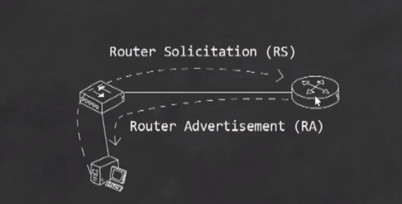
</p>
SLAAC functions using what are called Router Solicitation (RS) and Router Advertisement (RA) messages. The RS is sent by the client asking for addressing information, and the RA is sent as a response from the router. When a router sends an RA where the M and O flags are set to 0, this indicates to the client that SLAAC is available and IPv6 addressing information will be provided. 


### In order to enable SLAAC, these two flags must be disabled:
  * ```no ipv6 nd managed-config-flag```
  * ```no ipv6 nd other-config-flag``` 
* ```ipv6 address autoconfig``` – Enabling SLAAC.

## 1.14 Compare and Contrast IPv6 Address Types

### Unicast
Type | 64-bit | 64-bit | CIDR Notation
------------ | ------------ | ------------ | ------------
Unspecified | ```0000``` | ```::0``` | /128
Loopback | ```0000``` | ```::1``` | /128
Unique Local | ```FC00...(FD00)``` | ```::``` | /7 (/8)
IPv4 Mapped | ```...``` | ```FFFF``` | /96

* **Unspecified Address:** *Self-Explanatory* –– Default Route.
* **Loopback Address:** *Self-Explanatory* –– Helps us to test wether or not our interface is working correctly.
* **Unique Local Address (ULA):** Like Private IP Address.
* **IPv4 Mapped:** For Labs Only.

### Global Unicast
<p style="text-align: center;">
  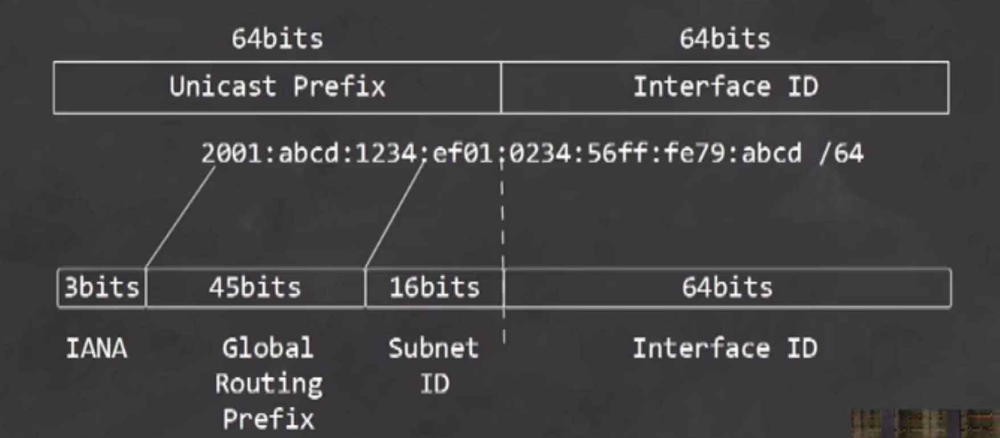
</p>

### Multicasts (Supercedes Broadcasts in IPv4)
Type | 64-bit | 64-bit | CIDR Notation
------------ | ------------ | ------------ | ------------
All Nodes | ```FF02``` | ```::1``` | /8
All Routers | ```FF02``` | ```::2``` | /8

### Link Local
```FE80::``` | ```...``` | /10
------------ | ------------ | ------------ 
* Not forwarded by router
* Host choose their own link local addresses
* Similar to APIPA (but useable)

### Modified EUI-64: Extended Unique Identifier
Identifying a unique **InterfaceID** using the MAC Address.
e.g. MAC Address: ```00-0C-29-B8-C8-76``` –– ```00000000:00001100:00101001:10111000:11001000:01110110```
1. We add 16 bits (FFFE) right in the middle: ```00-0C-29-[FF-FE]-B8-C8-76``` –– ```00000000:00001100:00101001[:11111111:11111010:]10111000:11001000:01110110```
2. We flip the 7th bit in the first section of the InterfaceID: ```0[2]-0C-29-[FF-FE]-B8-C8-76``` –– ```000000[1]0:00001100:00101001[:11111111:11111010:]10111000:11001000:01110110```

## Performing Initial Device Configuration
### Cisco Device Startup
<p style="text-align: center;">
  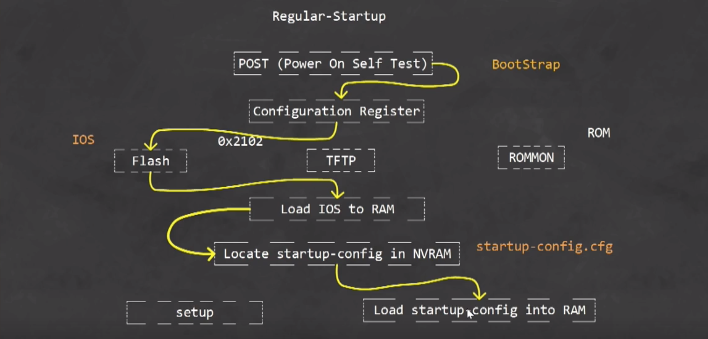
</p>

* **POST (Power On Self Test) –– Bootstrap:** Verifying that all the hardware is working the way that needs to.
* **Configuration Register:** Specifying the boot order.
* **Flash:** Works and functions like a hard drive of a computer.
* **RAM:** Decompressing the IOS and loading it.
* **NVRAM (Non-Volitle RAM):** Loacating the ```startup-config.cfg```

> If the NVRAM didn't locate a startup config file, it will lead us to the "Setup".

### Cisco IOS Name Breakdown
e.g. ```c2900-universalk9-mz.SPA.152-4.M6.bin```
1. ```c2900``` – Catalyst 2900
2. ```universal``` – Universal Feature Set
3. ```k9``` – Cryptography Support (SSH)
4. ```mz``` – Memory, Zipped
6. ```152-4``` – Version 15.2.4
7. ```M6``` – Rebuild

### Command Line Modes
* **User Exec Mode** - signified by the '>' at the end of the device name, e.g. ```NYACCESS1>```
* **Privileged Executive Mode** - signified by the # symbol at the end of the device name, e.g. ```NYACCESS1#```
* **Global Configuration Mode** - signified by the (config)# at the end of the device name, e.g. ```NYACCESS1(config)#```

### CLI Commands

**General**
* ```hostname <name>``` – Specifying a hostname for a Cisco Device.
* ```copy running-configuration startup-configuration``` – Saving configurations to the startup configurations file.
  * ```copy run start```
  * ```wr```
* ```erase startup-config``` – *Self-Explanatory.*
* ```terminal monitor``` – Enable syslog messages on a remote connection terminal.
* ```logging synchronous``` – This will allow the syslog messages to appear, but it will not obstruct our typing. 

**Show**
* ```show flash``` – Showing the contents of the flash. Most likely the home of the IOS image.
* ```show running-configuration``` – *Self-Explanatory.*
* ```show version``` – Showing information about the IOS software.
* ```show ip interface brief``` – *Self-Explanatory.*
* ```show ip ssh``` – Showing information about SSH.
* ```show controllers serial0/0/0``` 
    * One side becomes the master and the other becomes the slave (upstream and down stream device)
    * DTE V.35: Receives the clock speed doesn’t set it (Down stream)
    * DCE V.35: Sets the clock speed (Up stream)


**Security**
* ```enable secret <password>``` – Configuring a password to get into Privileged Executive Mode. Level 5 Encryption.
* ```enable password <password>``` – Configuring a password to get into Privileged Executive Mode. No encryption (Plain-text).
* ```service password-encryption``` – Encrypting the password used in the previous command. Level 7 Encryption.


**Interface Configuration**
* ```interface <interface_name>``` – Specifying interface to configure.
* ```ip address <ip> <sm>``` – Specifying an IP and a Subnet Mask for the interface.
* ```no shutdown``` – Turning on the interface.

**Remote Access - SSH**
* ```banner motd ^You are connected to NYACCESS1^``` – Specifying an infomational banner when accessing a Cisco device.
* ```ip domain-name <domaim>``` – Specifying a domain. *Essential for SSH!*
* ```crypto key generate rsa``` – Generating an RSA key. *Min. of 1024 for SSHv2*
* ```ip ssh version 2``` – Choosing version 2 of SSH as the default for remote access.
* ```line vty 0 15```
  * ```transport input ssh``` - Specifying that the only way of remote access is via SSH.
  * ```transport input telnet ssh``` – Device is accessable for remote access via SSH and Telnet.


