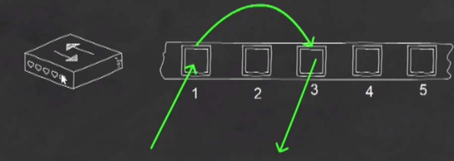
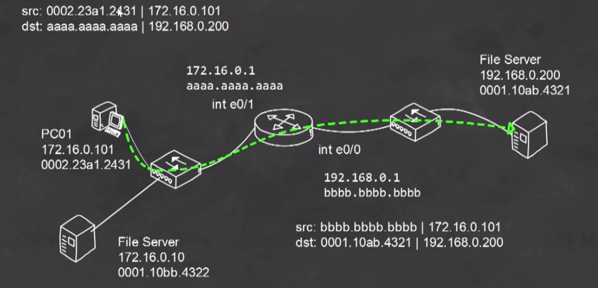
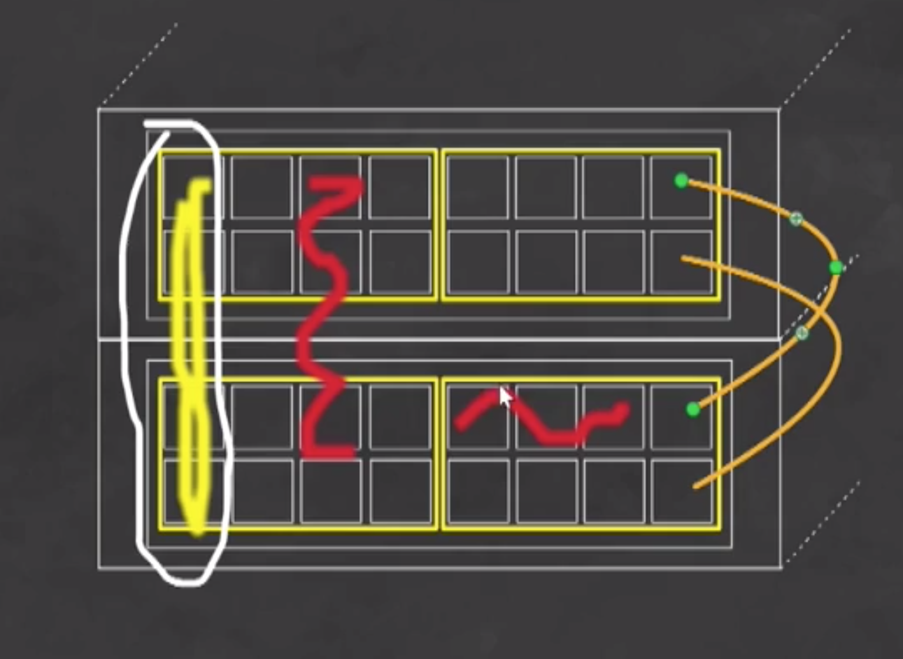
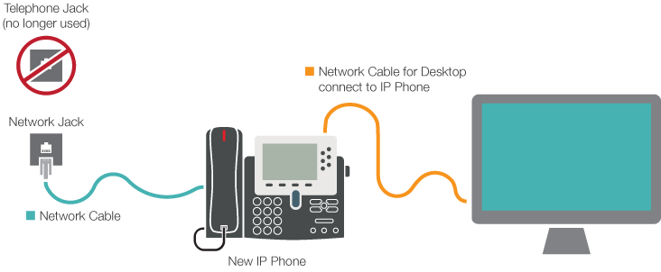

# 2.0 LAN Switching Fundementals
## 2.1 Describe and Verify Switching Concepts
### Hubs: One CollIsion Domain, One Broadcast Domain
Data that enters one port is automatically delivered out every other port simultaneously.
<p align="center">

</p>

### Switches
* Data entering a port is directed out of the destination port. The other ports do not even see the data.
* Switches will not send the data out of the same port the data arrieved on.
* Makes decisions based on MAC Address Table or CAM (Common Addressable Memory) Table.

<p align="center">

</p>

**Switch 3 Basic Functions**
1. Forward Data: Forwarding data from source port to destination port.
2. Filter Data
3. Flood Data: Acting like a hub – Sending data to every other port except for the one the data came in on.

### The ARP (Address Resolution Protocol) Process

<p align="center">

</p>

### Methods for Forwarding Data
Frame switching refers to the method by which a frame is switched, or transferred from the ingress interface to the egress interface. There are two main methods by which this is accomplished: Store-and-Forward and Cut-Through Ethernet switching.

All frames have a certain size in bytes. The maximum size is usually around 1500, although this can be adjusted. It takes a finite amount of time for a frame to enter a switch port. Depending on the method of switching, this amount of time can add latency to network communications.

#### Store-and-Forward
Switching does what its name suggests. It receives a frame and stores it in its entirety in the switch buffer before it begins sending it out of its egress port. This allows the switch to read and calculate the Frame Check Sequence which is in the trailer of the frame, to verify that there were no errors in transmission before it sends it out of the egress port. In this scenario, both latency and reliability are increased.

#### Cut-Through
Switching begins sending a frame out the egress port before it has been received in its entirety. Switching begins once the destination MAC address has been read from the header of the frame and the egress port has been determined. Here, latency is decreased as is reliability.

### CLI Commands

* ```show interface status``` – Show ports states.
* ```show interface <interface name>``` – Show interface information.
  * **Input queue** - indicates the number of frames in the input queue and its maximum size. Currently, the queue is empty, however, when Store-and-Forward is functioning, the incoming frames are stored in their entirety in this queue.
  * **Total output drops** - this is the number of drops that have been measured due to the queue being full.
  * **Queueing strategy** - this is the method by which frames will be queued. The method is First In First Out, or fifo.
  * **Output queue** - the size of the output queue and the number of frames currently in it.
* ```show mac address-table``` – *Self-Explanatory.*
  * ```show mac address-table dynamic``` – Show only the dynamic addresses.
  * ```show mac address-table static``` – Show only the static addresses.
  * ```show mac address-table count``` – Show addresses count.
* ```arp -a``` (Windows) – Show the MAC address table.
* ```mac address-table aging-time <number-in-sec>``` – Change the aging time.
  * Dynamically learned MAC addresses remain in the MAC address table for a specific period of time. If there is no activity from the specific MAC address after this specified period of time, the address is removed from the switch. It is possible to adjust this aging time according to your network needs.
* ```mac address-table static <mac-address> vlan <vlan-number> interface <interface-name>``` –  Configure a static MAC address entry in the MAC table

## 2.2 Interpret Ethernet Frame Format
### IEEE 802.3 Ethernet Frame
Preamable | SOF | DST MAC | SRC MAC | Len/Type | Data & Pad | FCS
------------ | ------------ | ------------ | ------------ | ------------ | ------------ | ------------ 
7 Bytes | 1 Bytes | 6 Bytes | 6 Bytes | 2 Bytes | 46 - 1500 Bytes | 4 Bytes

* Min. Frame Size: 64 bytes (exclude Premable and SOF)
* Max. Frame Size: ~1518 bytes

```
[SRC NIC]                                                   - - - - - - - >         [DST NIC]
* Final Step in Encapsulation:                                                      * Bits recieved on NIC (begins decapsulation)
Makes data into Frame (L2)

* Frame makes the data ready to transmit from the NIC.                              * Checks the DST MAC against its own MAC to verify destionation (2 possibilities)
```

* **Preamble:** Synchronization.
* **SOF (Start-Of-Frame):** Signal next byte is DST MAC.
* **DST (Destination) MAC:** Intended recipient of the frame.
* **SRC (Source) MAC:** Identifies sender of the frame.
* **Length or Type:** Defines length of data or Defines protocol in Frame.
* **Data & Pad:** L3 PDU.
* **FRC (Frame Check Sequence):** A method used by DST NIC to check for transmission errors. A.K.A **Trailer** in Wireshark.

## 2.3 Troubleshoot Interface and Cable Issues (Collisions, Errors, Duplex, Speed)
### Duplex: Half vs. Full
* **Half Duplex:** The interface can send *OR* recieve data, but it can't do both simultanously. *1 pair of wires.*
* **Full Duplex:** The interface can send *AND* recieve data simultanously. *At least 2 pairs of wires.*

### Medium Dependant Interface/MDI Crossover (MDIX)
In order to avoid mistakes by using the wrong type of cable for the wrong pair of devices, the MDI/MDIX functionality has been introduced to network devices. This feature automatically and electronically changes the pin outs of the appropriate switch ports to successfully connect devices regardless of whether a crossover of a straight through cable is used.
* *Cisco devices have MDIX on by default. To Disable it:* ```no mdix auto```

### CLI Commands
* ```show interface <interface-name> capailities``` – Showing interfaces capabilities in terms of L1 and L2.
  * Type: ```10/100BaseTX```
    * ```10/100``` – 100Mbps
    * ```Base``` – Copper Cabling
    * ```TX``` – Twisted Pair
  * Duplex: ```half, full, auto```
    * ```half```
    * ```full```
    * ```auto``` – If the other side is hard set to half/full, I'll set myself to half/full.
  > In older devices, when both device set to "auto", they will not know what to do. So when troubleshooting, hard set both ends. In new devices there is a default setting which prevent this probelm.
  * Speed: ```10, 100, auto```
* ```show running-config interface <interface-name>``` – Show the running configuration for a particular interface.
* ```duplex <type>``` – Hard setting the duplex to ```auto``` or ```half``` or ```full```
* ```speed <type>``` – Hard setting the speed to ```auto``` or ```10``` or ```100``` or ```1000```
* ```clear counters <interface-name>``` – Resetting the counters on the interface and display them again in a few seconds to determine if the collisions are currently occurring.
  * Runts - frames that are smaller than 64 bytes which are usually results of collisions
  * CRC errors - frames that have not passed the frame check sequence test in the trailer of the Ethernet frame
  * Giants - frames that are larger than the maximum size of 1500 bytes

## 2.4 Configure, Verify, and Troubleshoot VLANs (Normal Range) Spanning Multiple Switches
### VLANs: Virtual Local Area Networks
* Switches' function creates more but smaller collision domains; but do not create more broadcast domains by default.
* If we need more broadcast domains we have 2 choices: Routers separate broadcast domains by their functions, *OR* we can create VLANs (virtual local area networks)
* VLANs allows us to subdivide the switch ports logically.
* VLANs allows us to also use a switch to create broadcast domains on a single switch.
* A single *access* port can only be in a single VLAN at a time.
* **Default VLAN (native-VLAN):** VLAN1 is the default VLAN. It comes out of the box. 
  * We *can't* delete it. – ~~```no vlan 1```~~
  * We *can't* turn it off. – ~~```shutdown vlan 1```~~
  * We *can* change it.
* 2 - 1001 (Normal Range) / 1006 - 4094(Extended) 
  * We *can* delete.
  * We *can* add and manage.
* 1002-1005 (FDDI and token ring default VLAN) 
  * We *can't* delete these VLANS.
* We can assign ports on diffenent switches to the same VLAN which put them in the same broadcast domain.
* Since VLANs are different broadcast domains, they will not directly communicate with each other. They must connect to a router, and the router will do rout them to the proper VLAN. 
  * This is also doable by a multi-layer switch (Layer 3 Switch)
### Trunk Ports
Allow VLANs to use single link accross switches.
<p align="center">

</p>


### Two essential steps to configure VLANs: 
1. Create VLANs 
2. Assign ports to them.


> Anything we configure in VLANs is going to be written to ```vlan.dat``` file and it will be saved in the flash.

### CLI Commands
* ```show vlan``` – Showing the VLAN database.
* ```vlan <id>``` – Specifying a VLAN ID to configure.
    * ```name <name>``` – Specifying VLAN name in ASCII.
* ```show VLAN brief``` – Showing brief information on the VLAN database.
* ```switchport mode <mode>``` – Specifying a switch port mode.
    * ```access``` – For endpoint devices, a laptop, a computer workstation, etc.
    * ```trunk``` – *Explained.*
* ```switchport access vlan <id>``` – Assigning the port to a specific VLAN.
* ```interface range <fast/gigabitethernet> <start-port-number> - <number-of-ports>``` – Specifying multiple ports to configure.
    * e.g. – ```interface range fastethernet 1/0/3 - 10```
* ```switchport voice vlan <id>``` – Switchport mode for Cisco phones. 
  * Should be configured for data first.
  <p align="center">
    
  </p>

* ```show interface <port> switchport``` – Showing switchport information.

## 2.5 Configure, Verify, and Troubleshoot Inter-Switch Connectivity
* Every single port on the switch desires to become a trunk. (DTP: Dynamic Trunking Protocol)
* Hardset everything, don’t let ports negotiate!
* Shutdown the native/parking lot vlan

### CLI Commands
* ```switchport trunk encapsulation dol1q``` – Choosing frame encapsulation.
    * ```dot1q``` – Interface uses only 802.1q trunking encapsulation when trunking 
    * ```isl``` – Interface uses only ISL trunking encapsulation when trunking 
    * ```negotiate``` – Device will negotiate trunking encapsulation with peer on
* ```switchprort mode trunk``` – Enabling trunking on a specific interface (port).
* ```show interface trunk``` – Showing interfaces that trunking is enable on.
	* ```Vlans allowed on trunk``` – indicates that the whole range of possible VLANs are allowed on this trunk. This is the default setting for newly created trunks.
	* ```Vlans allowed and active in management domain``` – Shows the VLANs that currently exist on the switch and that are being transmitted over the trunk.

#### VTP: VLAN Trunking Protocol
* ```vtp domain <domain> // domain is case-sensitive```
* ```vtp mode <server,client,transparent>```
  * **VTP Server** – create, delete, and manage vlans
  * **VTP Client** – being updated by the vtp server
  * **VTP Transparent** – standalone
* ```vtp password <password>``` 
  * ```service password-encryption``` 
* ```vtp version 3``` 
* ```vtp primary``` – Must be specified on the VTP server to be allowed to push configurations.
* ```show vtp status```

* ```switchport trunk allowed vlan <id>,<id> // no space``` – Limiting a trunk link to specific vlans, this is used for security logging/monitoring purposes.
* ```switchport trunk native vlan <id>``` = Changing the native vlan for a trunk link.

## 2.6 Configure and Verify Layer 2 Protocols
### CDP: Cisco Discovery Protocol
* Allows us to discovery other cisco devices that are directly connected.
* Provides tons of info: platform model, port attached to, function of the device, ip address of the device, IOS version
* Allows you to build a good topology
* Cisco's own network discovery protocol.
* Layer 2 Protocol
* Normally enabled by default

### CLI Commands
* ```cdp run``` or ```no cdp run``` – Enabling/Disabling globally from global configuration mode 
* ```cdp enable``` or ```cdp disable``` – Enabling/Disabling per interface. 
* ```show cdp``` – Showing CDP configurations.
* ```show cdp neighbors``` – Showing the cisco devices that are connected to our device.
  * ```Device ID``` – Device hostname.
  * ```Local Intrfce``` – Connected from.
  * ```Hold tme``` – The time the protocol waits to decide if the other end active or not.
    * ```cdp holdtime <in-sec>``` – Changing CDP hold time.
  * ```Capability``` – *Self-Explained.*
  * ```Platform``` – Device Model.
  * ```Port ID``` – Connected to.

### LLDP: Link-Local Discovery Protocol
* Industry standard version of CDP, can be used with more than cisco devices.
* Cisco devices can run either CDP or LLDP, environment is the key as to which you run.

### CLI Commands
* ```show lldp``` – Showing Global LLDP information.
* ```lldp run``` – Enabling LLDP.
* ```lldp neighbors``` – Showing the devices that are connected to our device.

## 2.7 Configure, Verify, and Troubleshoot Port Security
Port Security allows us to implment security based on the MAC address.
We onlu implement port security on access switchports. It's doable on tunk ports but it's not the best practice.

### Static
* Manually configured MAC address
* Doesn't time out

### Dynamic
* Learned by connecting a device to port
* Timer

### Sticky
* Learned and stays with port until max number of MACs is full

### Max MAC addresses
* Each port can be configured to ensure up a certain number of allowed mac addresses

### Violation actions
* Violation Mode
  * **protect** — Drops packets with unknown source addresses until you remove a sufficient number ofsecure MAC addresses to drop below
the maximum value.
  * **restrict** — Drops packets with unknown source addresses until you remove a sufficient number ofsecure MAC addresses to drop below
  * The maximum value and causes the SecurityViolation counter to increment.
  * **shutdown** —Puts the interface into the error-disabled state immediately and sends an SNMP trap notification.
  * To avoid manualrecovery of the port from violation
  * Set aging timer

### Err-disable recovery
* Requires a manualrecovery of the port violation

### CLI Commands
* ```switchport port-security``` – Enabling port security. *Essential!!*
* ```show port-security interface <interface> address``` – See details about the address that has been dynamically learned.
* ```clear port-security sticky interface <interface>``` - Clearing port-security configurations on a particular interface.

#### Static 
* ```switchport mode access```
  * ```switchport port-security mad-address <mac-address>``` - Assining MAC address statically.
  * ```show port-security interface <interface>``` – port-security information on a specific interface.

#### Sticky
* ```switchport port-security mac-address sticky``` – Indicates that the switch will automatically learn the MAC address of the first device that is connected to this interface and it will keep it or let it “stick” in memory even if the device is removed.
* ```switchport port-security maximum 1``` – Indicates that only one MAC address may be learned; the second MAC address that connects will not be learned, nor will it “stick”
* ```switchport port-security violation shutdown``` – Defines what will happen if port security is violated, in this case, the port will shut down.

#### Err-Disable
* ```show errdisable recovery``` – Showing the err-disable configurations.
* ```errdisable recovery cause psecure-violation``` – Enabling err-disable recovery for port security violations.
* ```errdisable recovery interval 30``` – Allow a recovery after a timeout of 30 seconds.
